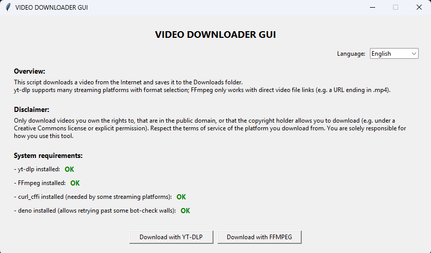
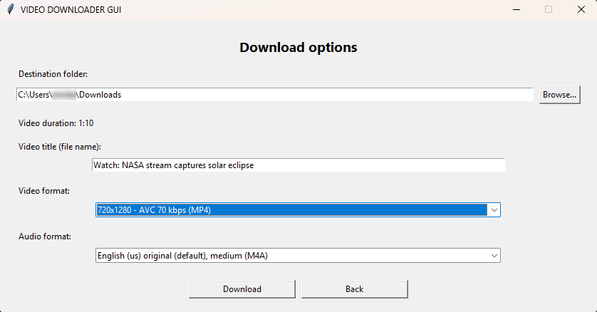

# Video Downloader GUI

**EN** — Windows GUI (Python/Tkinter) to download videos or playlists, including many streaming platforms, via yt-dlp or ffmpeg, with video/audio format selection and audio-only downloads.

**FR** — Interface graphique Windows (Python/Tkinter) pour télécharger des vidéos ou des playlists, de nombreuses plateformes de streaming comprises, via yt-dlp ou ffmpeg, avec choix des formats vidéo/audio et téléchargement audio seul.





## Disclaimer / Avertissement

- **EN**: Only download videos you own the rights to, that are in the public domain, or that the copyright holder allows you to download (e.g. under a Creative Commons license or explicit permission). Respect the terms of service of the platform you download from. You are solely responsible for how you use this tool.
- **FR** : Ne télécharger que des vidéos dont vous détenez les droits, qui sont dans le domaine public, ou dont l'ayant droit autorise le téléchargement (par exemple sous licence Creative Commons ou avec une autorisation explicite). Respecter les conditions d'utilisation de la plateforme depuis laquelle vous téléchargez. Vous êtes seul responsable de l'usage que vous faites de cet outil.

## Features / Fonctionnalités

- **EN**: Bilingual GUI (English/French), two download engines (yt-dlp for streaming platforms with video/audio format selection and playlist support, ffmpeg for direct video file links), audio-only downloads, link validation, duplicate filename protection, editable destination folder, live progress bar with cancel button, automatic retry past some bot-check walls (via deno, no browser cookies involved), download summary (size, duration, location, elapsed time).
- **FR** : Interface bilingue (anglais/français), deux moteurs de téléchargement (yt-dlp pour les plateformes de streaming avec choix des formats vidéo/audio et prise en charge des playlists, ffmpeg pour les liens directs vers un fichier vidéo), téléchargement audio seul, vérification du lien, protection contre l'écrasement de fichiers, dossier de destination modifiable, barre de progression en temps réel avec bouton d'annulation, nouvelle tentative automatique face à certaines vérifications anti-bot (via deno, sans recours aux cookies du navigateur), récapitulatif du téléchargement (taille, durée, emplacement, durée de l'opération).

## Requirements / Prérequis

- Python 3.10+
- At least one of / au moins l'un des deux :
  - [yt-dlp](https://github.com/yt-dlp/yt-dlp) (`pip install yt-dlp`)
  - [ffmpeg](https://ffmpeg.org/download.html) (must be available in your system `PATH`)
- Optional / optionnel : [curl_cffi](https://github.com/lexiforest/curl_cffi) — required by some streaming platforms for yt-dlp. Only versions `0.5.10` or `0.10.x` are currently supported by yt-dlp. / requis par certaines plateformes de streaming pour yt-dlp. Seules les versions `0.5.10` ou `0.10.x` sont actuellement supportées par yt-dlp. `pip install -r requirements.txt`
- Optional / optionnel : [deno](https://deno.com/) (must be available in your system `PATH`) — lets yt-dlp automatically retry past some bot-check walls. / (doit être disponible dans le `PATH` du système) — permet à yt-dlp de retenter automatiquement face à certaines vérifications anti-bot.

## Usage / Utilisation

```bash
python video_downloader_gui.py
```

The app detects available dependencies at startup and shows their status on the introduction screen. / L'application détecte les dépendances disponibles au démarrage et affiche leur statut sur l'écran d'introduction.

## Development / Développement

- **EN**: `pip install -r requirements-dev.txt` then `python -m pytest` runs the unit test suite covering the pure helper functions (filename sanitization, progress parsing, etc.), and `ruff check .` runs the linter (config in `ruff.toml`). Both run automatically on GitHub Actions for every push and pull request.
- **FR** : `pip install -r requirements-dev.txt` puis `python -m pytest` exécute la suite de tests unitaires couvrant les fonctions utilitaires pures (nettoyage de nom de fichier, analyse de la progression, etc.), et `ruff check .` exécute le linter (configuration dans `ruff.toml`). Les deux s'exécutent automatiquement via GitHub Actions à chaque push et pull request.

## Known limitation / Limitation connue

- **EN**: Some streaming platforms require a bot-check verification (e.g. a sign-in confirmation) for certain videos. When `deno` is installed, the tool automatically retries once past some of these checks (via yt-dlp's official PO token solver, `--remote-components ejs:github`) — no browser cookies or session data are ever involved. This retry is not guaranteed to succeed for every video, and the tool deliberately never falls back to browser cookies to bypass it further, as that would require exposing the user's session tokens — a security risk this project chooses not to introduce. Videos still blocked after the retry (or without `deno` installed) cannot be downloaded through this tool.
- **FR** : Certaines plateformes de streaming exigent une vérification anti-bot (par exemple une confirmation de connexion) pour certaines vidéos. Lorsque `deno` est installé, l'outil retente automatiquement une fois de passer certaines de ces vérifications (via le résolveur de challenge PO token officiel de yt-dlp, `--remote-components ejs:github`) — aucun cookie ni donnée de session du navigateur n'est jamais utilisé. Cette nouvelle tentative n'est pas garantie de réussir pour toutes les vidéos, et l'outil ne recourt volontairement jamais aux cookies du navigateur pour aller plus loin, car cela nécessiterait d'exposer les jetons de session de l'utilisateur — un risque de sécurité que ce projet choisit de ne pas introduire. Les vidéos toujours bloquées après cette tentative (ou sans `deno` installé) ne peuvent pas être téléchargées avec cet outil.

## License / Licence

[MIT](LICENSE)
